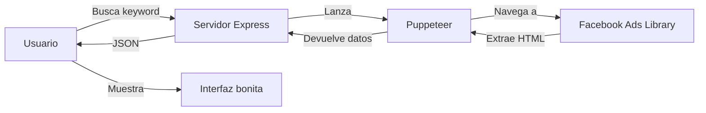

# 🔍 Facebook Ads Library Scraper

**Herramienta de web scraping con Puppeteer para extraer anuncios de Facebook Ads Library**


---

## 📋 ¿Qué hace?

Extrae automáticamente información de anuncios públicos de Facebook Ads Library:
- ✅ Logo de la página
- ✅ Texto promocional con emojis
- ✅ Imágenes y videos
- ✅ Botón CTA (Call to Action) con enlace real
- ✅ Fecha de inicio
- ✅ ID de biblioteca

---

## 🚀 Inicio Rápido

### 1. Instalar dependencias
```bash
npm install
```

### 2. Iniciar servidor
```bash
npm start
```

### 3. Abrir navegador
```
http://localhost:3000
```

### 4. Buscar anuncios
- Escribe una palabra clave (ej: "nike.com", "adidas", "coca-cola")
- Selecciona cantidad de resultados (máx 100)
- Click en "Buscar Anuncios"
- Espera 30-60 segundos
- ¡Resultados!

---

## 🛠️ Tecnologías

- **[Puppeteer](https://pptr.dev)** - Automatización de navegador (headless Chrome)
- **Express.js** - Servidor web Node.js
- **HTML/CSS/JS** - Interfaz de usuario

---

## 📁 Estructura del Proyecto

```
ads-intelligence-main/
├── server.js           # Servidor Node.js + lógica de scraping
├── package.json        # Dependencias y scripts
├── public/
│   └── index.html      # Interfaz web
├── README.md           # Este archivo
└── COMO_FUNCIONA.md    # Explicación técnica detallada
```

---

## 🎯 Cómo Funciona (Resumen)



1. Usuario ingresa búsqueda en `localhost:3000`
2. Servidor lanza navegador Puppeteer (headless)
3. Puppeteer visita Facebook Ads Library
4. Hace scroll y espera carga completa
5. Extrae información con selectores CSS
6. Devuelve JSON al navegador
7. Interfaz muestra resultados con diseño similar a Facebook

**📖 Para explicación detallada:** Ver `COMO_FUNCIONA.md`

---

## 💡 Ejemplos de Búsqueda

| Tipo | Ejemplo | Resultados |
|------|---------|------------|
| Dominio | `nike.com` | Anuncios que mencionan nike.com |
| Marca | `adidas` | Anuncios con palabra "adidas" |
| Producto | `iphone 15` | Anuncios de iPhone 15 |
| Tienda | `amazon` | Anuncios de Amazon |
| Nicho | `yoga mat` | Anuncios de tapetes de yoga |

---

## ⚙️ Configuración Avanzada

### Cambiar puerto del servidor
```javascript
// server.js línea 4
const PORT = 3000; // Cambiar a 8080, 5000, etc.
```

### Aumentar tiempo de espera (si no carga)
```javascript
// server.js línea 88
await new Promise(resolve => setTimeout(resolve, 20000)); // 20 segundos
```

### Cambiar cantidad de scrolls
```javascript
// server.js línea 100
for (let i = 0; i < 10; i++) { // Más scrolls = más anuncios
```

---

## 🐛 Solución de Problemas

### ❌ Error: Puerto 3000 en uso
```bash
# Windows
netstat -ano | findstr :3000
taskkill /PID [numero] /F

# Mac/Linux
lsof -ti:3000 | xargs kill -9
```

### ❌ No encuentra anuncios
- Aumentar tiempo de espera (línea 88)
- Aumentar cantidad de scrolls (línea 100)
- Verificar que la keyword existe en Facebook Ads Library

### ❌ Servidor no inicia
```bash
# Reinstalar dependencias
rm -rf node_modules package-lock.json
npm install
```

### ❌ Facebook bloquea peticiones
- Esperar 1-2 horas
- No hacer más de 10 búsquedas por hora
- Considerar usar proxies (avanzado)

---

## 📊 Formato de Datos (JSON)

```json
{
  "success": true,
  "keyword": "nike.com",
  "total": 25,
  "fecha_extraccion": "2025-10-20T01:23:45.678Z",
  "anuncios": [
    {
      "numero": 1,
      "pagina": "Nike",
      "logo_url": "https://scontent.fbcdn.net/...",
      "id_biblioteca": "1234567890123456",
      "fecha_inicio": "14 oct 2025",
      "texto": "Just Do It! 🏃‍♂️ New arrivals...",
      "imagenes": 3,
      "imagenes_urls": ["url1.jpg", "url2.jpg"],
      "video": {
        "poster": "thumbnail.jpg",
        "src": "video.mp4"
      },
      "cta": {
        "domain": "NIKE.COM",
        "title": "New Arrivals",
        "subtitle": "Free Shipping",
        "button": "Shop Now",
        "url": "https://nike.com/products/new"
      }
    }
  ]
}
```

---

## ⚠️ Limitaciones y Avisos

### ⚖️ Legal
- Solo accede a datos **públicos** de Facebook Ads Library
- Viola términos de servicio de Facebook (scraping automatizado)
- Úsalo **solo para fines personales/educativos**
- No vendas los datos ni los uses comercialmente sin autorización

### 🚫 Técnicas
- Más lento que API oficial (30-60 segundos)
- Facebook puede bloquear si haces muchas peticiones
- Puede dejar de funcionar si Facebook cambia su HTML
- Limitado por velocidad de scroll y carga de página

### 🛡️ Buenas Prácticas
- ✅ Máximo 10 búsquedas por hora
- ✅ Usa para investigación de mercado personal
- ✅ Respeta privacidad de terceros
- ❌ No hacer spam ni scraping masivo
- ❌ No replicar exactamente anuncios de otros

---

## 📈 Casos de Uso Recomendados

1. **Análisis de Competencia**
   - Ver qué anuncios usan tus competidores
   - Identificar estrategias que funcionan
   - Benchmarking de copy y creatividades

2. **Investigación de Mercado**
   - Tendencias en publicidad
   - Ofertas comunes en tu nicho
   - Pricing competitivo

3. **Inspiración Creativa**
   - Ideas para tus propios anuncios
   - Formatos populares
   - CTAs efectivos

4. **Monitoreo de Marca**
   - Detectar quién menciona tu marca
   - Identificar plagio de productos
   - Vigilar competencia directa

---

## 🔄 Actualizaciones

### v1.0.0 (Actual)
- ✅ Scraping funcional de Facebook Ads Library
- ✅ Extracción de logos reales
- ✅ Videos con controles
- ✅ Enlaces CTA directos a páginas de destino
- ✅ Interfaz moderna tipo Facebook
- ✅ Modo headless (sin navegador visible)
- ✅ Descarga de resultados en JSON

---

## 🤝 Contribuciones

Este es un proyecto educativo. Si Facebook cambia su estructura:

1. Inspeccionar página con Chrome DevTools
2. Identificar nuevos selectores CSS
3. Actualizar `server.js` líneas 121-253
4. Probar con búsqueda de prueba

---

## 📞 Soporte

**Problemas comunes:**
- Ver `COMO_FUNCIONA.md` para detalles técnicos
- Revisar terminal para mensajes de error
- Verificar que Node.js esté actualizado (v18+)
- Comprobar conexión a internet

---

## 📚 Recursos Adicionales

- [Documentación de Puppeteer](https://pptr.dev)
- [Facebook Ads Library](https://www.facebook.com/ads/library)
- [Express.js Docs](https://expressjs.com)
- [Web Scraping Guide](https://en.wikipedia.org/wiki/Web_scraping)

---

## 📄 Licencia

MIT License - Uso educativo y personal

**⚠️ Disclaimer:** Esta herramienta es solo para fines educativos. El scraping automatizado de Facebook puede violar sus términos de servicio. Úsala bajo tu propia responsabilidad.

---

**Creado con ❤️ usando Puppeteer y Express.js**

🚀 ¡Feliz scraping!

